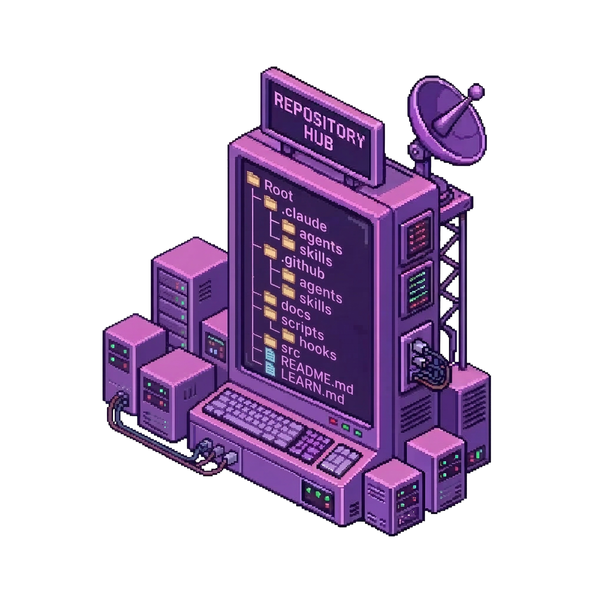
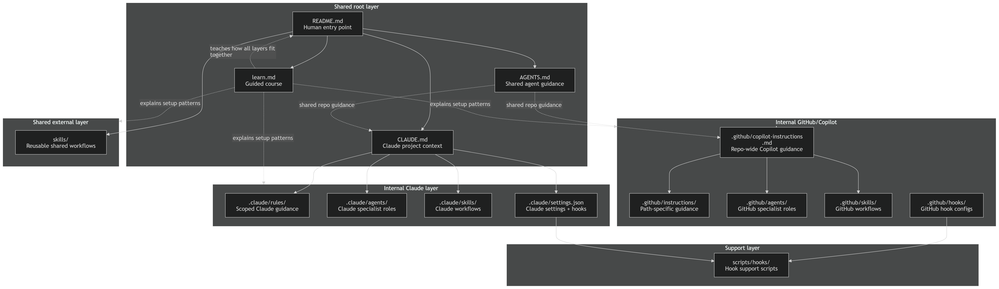

<div align="center">



# ai-repo-structure

**A practical learning repository for structuring a real AI-enabled project**  
**with shared instructions, Claude-specific configuration, GitHub/Copilot configuration, hooks, and reusable skills.**

<br/>

[](#current-status)
[](#overview)
[](#who-this-is-for)
[](./LEARN.md)
[](#shared-root-layer)
[](#internal-claude-layer)
[](#internal-githubcopilot-layer)
[](#shared-external-skills)
[](#what-hooks-are-doing-here)

</div>

---

## Overview

`ai-repo-structure` is a real learning repository that demonstrates how to structure a project around modern AI coding tools in a way that is practical, understandable, and reusable from the AI agents.

This is not just a mock folder tree.  
It is a working reference repo whose own AI setup is part of the lesson.

It shows how to combine:

- shared agent instructions with [`AGENTS.md`](./AGENTS.md)
- Claude-specific guidance with [`CLAUDE.md`](./CLAUDE.md)
- internal Claude rules, agents, skills, and hooks in [`.claude/`](./.claude)
- internal GitHub Copilot instructions, agents, skills, and optional Copilot coding agent hooks in [`.github/`](./.github)
- external/shared skills in [`skills/`](./skills)
- course for understanding and copying the system [`LEARN.md`](./LEARN.md)

---

## Quick navigation

- [ai-repo-structure](#ai-repo-structure)
  - [Overview](#overview)
  - [Quick navigation](#quick-navigation)
  - [Who this is for](#who-this-is-for)
  - [Learn this repo](#learn-this-repo)
  - [Why this repo exists](#why-this-repo-exists)
  - [How to read this repo](#how-to-read-this-repo)
  - [How the AI layers connect](#how-the-ai-layers-connect)
  - [This diagram shows which files explain the repo, which files guide tools, and which folders contain reusable workflows or automation.](#this-diagram-shows-which-files-explain-the-repo-which-files-guide-tools-and-which-folders-contain-reusable-workflows-or-automation)
  - [Current project structure](#current-project-structure)
  - [Shared root layer](#shared-root-layer)
    - [`README.md`](#readmemd)
    - [`AGENTS.md`](#agentsmd)
    - [`CLAUDE.md`](#claudemd)
  - [Internal Claude layer](#internal-claude-layer)
    - [`.claude/agents/`](#claudeagents)
    - [`.claude/rules/`](#clauderules)
    - [`.claude/skills/`](#claudeskills)
      - [`.claude/skills/validate-learning-repo/`](#claudeskillsvalidate-learning-repo)
    - [`.claude/settings.json`](#claudesettingsjson)
  - [Internal GitHub/Copilot layer](#internal-githubcopilot-layer)
    - [`.github/copilot-instructions.md`](#githubcopilot-instructionsmd)
    - [`.github/instructions/`](#githubinstructions)
    - [`.github/agents/`](#githubagents)
    - [`.github/hooks/`](#githubhooks)
    - [`.github/skills/`](#githubskills)
      - [`.github/skills/review-learning-repo-pr/`](#githubskillsreview-learning-repo-pr)
  - [Shared external skills](#shared-external-skills)
    - [`skills/use-this-repo/`](#skillsuse-this-repo)
  - [Support scripts](#support-scripts)
    - [`scripts/hooks/`](#scriptshooks)
  - [What hooks are doing here](#what-hooks-are-doing-here)
  - [What this repo is demonstrating](#what-this-repo-is-demonstrating)
  - [Current status](#current-status)
  - [One-line description](#one-line-description)

---


## Who this is for

This repo is for:

- developers building an AI-enabled repo from scratch
- teams that want a cleaner AI setup
- people learning what each AI-related file is for
- maintainers who want internal AI helpers for review, structure, and documentation
- anyone who wants a repo that is both a template and a teaching example

---

## Learn this repo

Want the guided version instead of just the structure?

Read [`LEARN.md`](./learn.md) for a short course that explains:

- what each AI layer is for
- how the files relate to each other
- best practices for writing them
- templates you can copy
- real examples you can adapt

---

## Why this repo exists

This repository helps answer questions like:

- What is `AGENTS.md` for?
- What belongs in `CLAUDE.md`?
- What is the difference between rules, instructions, agents, skills, and hooks?
- How do I keep an AI repo clean instead of chaotic?
- How do I build a template repo that is also a real example?

So this repo has three jobs at the same time:

- **template repo**
- **reference implementation**
- **learning repo**

---

## How to read this repo

A simple reading order is:

1. [`README.md`](./README.md)
2. [`AGENTS.md`](./AGENTS.md)
3. [`CLAUDE.md`](./CLAUDE.md)
4. [`.claude/`](./.claude)
5. [`.github/`](./.github)
6. [`skills/`](./skills)
7. [`scripts/hooks/`](./scripts/hooks)
8. [`LEARN.md`](./LEARN.md)

---

## How the AI layers connect

- `README.md` introduces the repo and points people to the right places.
- `AGENTS.md` gives shared guidance for coding agents.
- `CLAUDE.md` gives Claude project-specific context.
- `.claude/` contains Claude-only maintainer pieces.
- `.github/` contains GitHub/Copilot-only maintainer pieces.
- `skills/` contains shared reusable workflows.
- `scripts/hooks/` supports hook automation for Claude and GitHub/Copilot.
- `LEARN.md` is the guided course for understanding and copying the system.
  


This diagram shows which files explain the repo, which files guide tools, and which folders contain reusable workflows or automation.
---

## Current project structure

```
ai-repo-structure/
├─ .claude/                                      # Internal Claude layer for repo maintainers
│  ├─ agents/                                    # Claude subagents specialized for this repo
│  │  └─ learning-repo-maintainer.md             # Claude agent that maintains repo structure and learning quality
│  ├─ rules/                                     # Always-on or scoped Claude guidance for this repo
│  │  └─ repo-learning.md                        # Rule that keeps the repo accurate as a teaching/learning repo
│  ├─ skills/                                    # Claude skills for repeatable internal maintainer workflows
│  │  └─ validate-learning-repo/                 # Claude skill that audits whether the repo still matches what it teaches
│  │     ├─ assets/                              # Reusable output resources for the skill
│  │     │  └─ report-template.md                # Template for reporting validation results
│  │     ├─ references/                          # Supporting docs the skill reads while working
│  │     │  └─ checklist.md                      # Checklist for validating structure, naming, and teaching quality
│  │     ├─ scripts/                             # Helper scripts used by the skill
│  │     │  └─ check-required-files.sh           # Script that checks whether required repo files exist
│  │     └─ SKILL.md                             # Main Claude skill definition and workflow instructions
│  └─ settings.json                              # Claude project settings; needed here because Claude project hooks live here
│
├─ .github/                                      # Internal GitHub/Copilot layer for repo maintainers
│  ├─ agents/                                    # Custom GitHub Copilot agents for this repo
│  │  └─ learning-repo-maintainer.agent.md       # GitHub-side maintainer agent for repo structure and learning content
│  ├─ instructions/                              # Path-specific Copilot instructions
│  │  └─ learning-content.instructions.md        # Copilot guidance for README, AGENTS, CLAUDE, and other teaching content
│  ├─ hooks/                                     # GitHub/Copilot workspace hook configs
│  │  └─ session-start-check.json                # Official sessionStart hook config for validating core repo guidance
│  ├─ skills/                                    # GitHub Copilot skills for repeatable maintainer workflows
│  │  └─ review-learning-repo-pr/                # GitHub skill for reviewing PRs that change the repo’s learning structure
│  │     ├─ assets/                              # Reusable review output resources
│  │     │  └─ review-template.md                # Template for writing PR review findings
│  │     ├─ references/                          # Supporting docs for the review skill
│  │     │  └─ review-checklist.md               # Checklist for reviewing structure, naming, and correctness
│  │     ├─ scripts/                             # Helper scripts used by the review skill
│  │     │  └─ list-learning-files.sh            # Script that lists learning-related files changed in a PR
│  │     └─ SKILL.md                             # Main GitHub skill definition and PR review workflow
│  └─ copilot-instructions.md                    # Main repo-wide GitHub Copilot instructions
│
├─ skills/                                       # External/shared skills for users of the repo and outside agents
│  └─ use-this-repo/                             # Main external skill for understanding and adopting this repo
│     ├─ assets/                                 # Reusable templates for user-facing outputs
│     │  └─ adoption-plan-template.md            # Template for suggesting how someone should adopt this repo
│     ├─ references/                             # Supporting docs for understanding the repo
│     │  └─ repo-map.md                          # Explanation of the repo layers and what each one is for
│     ├─ scripts/                                # Helper scripts for external/shared usage
│     │  └─ quickstart-check.sh                  # Script that checks whether the expected starter structure exists
│     └─ SKILL.md                                # Main external skill definition for using this repo as a guide
│
├─ docs/                                         # Public documentation site for GitHub Pages and Google indexing
│  ├─ _config.yml                                # GitHub Pages / Jekyll site configuration 
│  ├─ index.md                                   # Main landing page of the docs site
│  ├─ repo-structure.md                          # Page explaining the repository structure and each main layer
│  ├─ claude-vs-copilot.md                       # Page comparing the Claude-specific and GitHub Copilot-specific parts
│  ├─ getting-started.md                         # Page showing how to use this repo as a starter, reference, or learning repo
│  ├─ robots.txt                                 # Search engine crawler instructions for the public docs site
│  └─ sitemap.xml                                # List of site pages to help Google and other search engines discover them
│
├─ scripts/                                      # Shared repo utility scripts
│  └─ hooks/                                     # Helper scripts used by Claude and GitHub/Copilot hooks
│     ├─ claude-session-context.sh               # Emits repo context for Claude SessionStart
│     └─ github-session-start-check.sh           # Bash sessionStart check for GitHub Copilot coding agent hooks
│
├─ src/                                          # Project source area; currently present as the code/application folder
|  ├─ index.html                                 # Small HTML shell for the demo page
|  ├─ styles.css                                 # Minimal styles for the AI Repo Map layout
|  └─ app.js                                     # Small script that renders the repo map content
|
├─ AGENTS.md                                     # Shared agent-facing instructions for coding agents working in the repo
├─ CLAUDE.md                                     # Main Claude-specific project guidance
├─ LEARN.md                                      # Course for understanding and copying the system
└─ README.md                                     # Main human entry point; will become the learning guide/course for the repo
```

---

## Shared root layer

This is the highest-level explanation layer of the repo.

### [`README.md`](./README.md)
The human entry point.

It explains:

- what the repo is
- how the layers fit together
- how to read and reuse the structure

### [`AGENTS.md`](./AGENTS.md)
The shared instruction file for coding agents.

Think of it as a README for agents:

- setup
- commands
- conventions
- workflow rules
- boundaries

### [`CLAUDE.md`](./CLAUDE.md)
The Claude-specific guide for the project.

It tells Claude:

- what kind of repo this is
- how the repo is organized
- what conventions matter
- how to work safely in this project

---

## Internal Claude layer

This is the internal Claude maintainer system.

It exists to help maintain the repo itself.

### [`.claude/agents/`](./.claude/agents)
Claude subagents for this repo.

- `learning-repo-maintainer.md`  
  A focused Claude maintainer for repo structure, learning quality, and consistency.

### [`.claude/rules/`](./.claude/rules)
Claude-scoped project guidance.

- `repo-learning.md`  
  Keeps the repo accurate as a teaching repo and prevents made-up conventions or mismatched examples.

### [`.claude/skills/`](./.claude/skills)
Reusable Claude maintainer workflows.

#### [`.claude/skills/validate-learning-repo/`](./.claude/skills/validate-learning-repo)
A skill that checks whether the repo still matches what it teaches.

One level deeper:

- `assets/`  
  Reusable output pieces used by the skill.
- `assets/report-template.md`  
  A template for validation output.

- `references/`  
  Supporting docs the skill reads while working.
- `references/checklist.md`  
  A checklist for structure, naming, and teaching quality.

- `scripts/`  
  Helper scripts used by the skill.
- `scripts/check-required-files.sh`  
  Checks whether required files exist.

- `SKILL.md`  
  The main skill definition and workflow instructions.

### [`.claude/settings.json`](./.claude/settings.json)
Claude project settings.

In this repo, it matters because Claude hooks are configured through settings and used to inject session-start context.

---

## Internal GitHub/Copilot layer

This is the internal GitHub/Copilot maintainer system.

Its role is similar to `.claude/`, but on the GitHub side.

### [`.github/copilot-instructions.md`](./.github/copilot-instructions.md)
The repo-wide Copilot guide.

It gives broad project instructions that should apply across the repository.

### [`.github/instructions/`](./.github/instructions)
Path-specific Copilot guidance.

- `learning-content.instructions.md`  
  Extra guidance for teaching content such as `README.md`, `AGENTS.md`, `CLAUDE.md`, and other repo-learning files.

### [`.github/agents/`](./.github/agents)
Custom GitHub Copilot agents for this repo.

- `learning-repo-maintainer.agent.md`  
  A GitHub-side maintainer agent focused on structure, learning quality, and consistency.

### [`.github/hooks/`](./.github/hooks)
Optional GitHub Copilot coding agent hook configs.

These files use GitHub's documented `.github/hooks/*.json` format for Copilot coding agent on GitHub and GitHub Copilot CLI. They are not a general GitHub repository feature and they are not GitHub Actions.

- `session-start-check.json`  
  An official `sessionStart` hook config that runs a small deterministic startup check for core repo guidance files.

### [`.github/skills/`](./.github/skills)
Reusable GitHub/Copilot maintainer workflows.

#### [`.github/skills/review-learning-repo-pr/`](./.github/skills/review-learning-repo-pr)
A skill for reviewing pull requests that change the repo's learning structure.

One level deeper:

- `assets/`  
  Reusable review output pieces.
- `assets/review-template.md`  
  A template for review findings.

- `references/`  
  Supporting docs used during review.
- `references/review-checklist.md`  
  A checklist for structure, naming, and correctness.

- `scripts/`  
  Helper scripts used by the skill.
- `scripts/list-learning-files.sh`  
  Lists learning-related files changed in a PR.

- `SKILL.md`  
  The main skill definition and review workflow.

---

## Shared external skills

This is the external/shared layer.

Unlike `.claude/` and `.github/`, this layer is mainly for users of the repo and outside agents.

### [`skills/use-this-repo/`](./skills/use-this-repo)
The main shared skill for understanding and adopting this repository.

One level deeper:

- `assets/`  
  Reusable user-facing output pieces.
- `assets/adoption-plan-template.md`  
  A template for suggesting how to adopt the repo.

- `references/`  
  Supporting docs for understanding the repo.
- `references/repo-map.md`  
  A simple map of the repo layers and their roles.

- `scripts/`  
  Helper scripts for shared usage.
- `scripts/quickstart-check.sh`  
  Checks whether the expected starter structure exists.

- `SKILL.md`  
  The main shared skill definition.

---

## Support scripts

This is the shared technical support layer.

### [`scripts/hooks/`](./scripts/hooks)
Helper scripts used by hooks.

- `claude-session-context.sh`  
  Emits repo context for Claude session start.

- `github-session-start-check.sh`  
  Bash support script for a GitHub Copilot coding agent `sessionStart` hook.

These scripts are not the lesson itself.  
They support the automatic orientation behavior.

---

## What hooks are doing here

Hooks are automatic commands that run at defined lifecycle events.

In this repo, hooks are used for something simple and useful:

- a session starts
- Claude can receive quick orientation context
- GitHub Copilot coding agent can run an optional deterministic startup check

That is a good fit because it is:

- deterministic
- low-risk
- practical
- directly connected to the purpose of the repo

---

## What this repo is demonstrating

This project shows a few important ideas:

1. **AI files should have clear roles**  
   Not everything belongs in one giant instruction file.

2. **Internal and external AI layers should be separated**  
   Maintainer AI is different from user-facing AI.

3. **Agents, skills, rules, instructions, and hooks each do different jobs**  
   - rules and instructions = guidance  
   - agents = specialized roles  
   - skills = reusable workflows  
   - hooks = optional deterministic automation for supported runtimes

4. **A template repo should still feel real**  
   The best template repos do not only name folders.  
   They show meaningful files and realistic relationships.

---

## Current status

This repo is already in a strong foundation stage.

It already has:

- the root instruction files
- one Claude rule
- one Claude agent
- one Claude skill
- one GitHub instruction set
- one GitHub agent
- one GitHub skill
- one external shared skill
- one optional hook on each side

That means the repo is already more than an idea.  
It has a real internal architecture.

---

## One-line description

`ai-repo-structure` is a practical learning repository that demonstrates how to structure a real AI-enabled project using shared agent instructions, Claude-specific configuration, GitHub/Copilot-specific configuration, internal maintainer agents and skills, hooks, and external shared skills.
